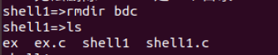

## 实验3.1 进程管理实验-shell编程

## 实验1

#### 实验目的

通过编写shell程序，了解子进程的创建和父进程与子进程间的协同，获得多进程程序的编程经验

#### 实验内容

设计一个简单的shell解释程序，能实现基本的bsh功能

#### 实验设计原理

##### shell原理

> shell是一个管理进程和运行程序的程序

其主要功能：

* 运行程序
* 管理输入输出
* 可编程

shell主循环

````
while(!end_of_input)
	get command
	excute command
	wait for command to finish
````

##### <code>execvp()</code>

> 执行文件函数

头文件<code>#include <unistd.h></code>

函数原型

````c
int execvp(const char *file,char * const argv());
//execvp()会从PATH 环境变量所指的目录中查找符合参数file 的文件名, 找到后便执行该文件, 然后将第二个参数argv 传给该欲执行的文件。
````

##### 设计思想

* 首先我们要将读入输入的命令分隔为子段压入<code>argv</code>栈，将命令存入<code>cmd</code>
* 调用子进程，执行这条命令(运行相应程序，使用<code>execvp()</code>），如果命令本身正确等待其执行完毕，如果命令使用有误，等待其输出提示
* 如果命令本身有误，输出命令不存在的提示

##### 补充

###### <code>strtok()</code>的使用

原型

````c
char *strtok(char s[], const char *delim);
//s为要分解的字符串，delim为分隔符字符串(该字符串中每个字符都单独为分割字符)
//首次调用时，s指向要分解的字符串，之后再次调用要把s摄成NULL
````

#### 实验步骤

实验源代码

````c
#include <stdio.h>
#include <string.h>
#include <stdlib.h>
#define BUFFER_SIZE 256

int main()
{
	char buf[BUFFER_SIZE],*cmd,*argv[20];
	char c;
	int n,v,length;
	length=0;

	while(1){
		printf("shell1=>");

		c=getchar();
		while(c!='\n' && length<BUFFER_SIZE){
			buf[length++]=c;
			c=getchar();
		}

		if(length>=BUFFER_SIZE){
			printf("命令过长！请重新输入\n");
			length=0;
			continue;
		}
		else buf[length]='\0';

		cmd=strtok(buf," \t\n");//分隔出的首个为命令名
		if(cmd){
			if(strcmp(cmd,"exit")==0)
				exit(0);
			argv[0]=cmd;
			n=1;
			while(argv[n++]=strtok(NULL," \t\n"));//再次调用strtok，s指向NULL，分割出参数
			if(fork()==0){
				execvp(cmd,argv);
				fprintf(stderr, "%s command not found.\n",buf );//错误输出
				exit(1);
			}
			wait(&v);
		length=0;
		}
	}
}
````

#### 实验结果及分析

* 使用<code>ls</code>查看当前目录下文件

  

  显示当前目录下的文件

* 使用带可选项查看当前目录下文件

  

  长格式显示文件，显示文件inode信息

* 使用<code>mkdir</code>在当前目录下，创建一个名为<code>bdc</code>的空文件夹

  

  文件夹创建成功

* 使用<code>rm</code>删除<code>bdc</code>文件夹(错误的用法)

  

  显示无法删除

* 使用<code>rmdir</code>删除<code>bdc</code>文件夹(正确用法)

  

  文件夹已被成功删除

* 使用<code>ps</code>显示当前进程状态

  

  显示进程状态信息

* 输入不正确的命令

  

  显示命令未找到

* <code>exit</code>退出

  

  退出成功

* 其他例子

  

  

分析：

* 在命令本身正确的情况下
  * 若使用方式正确，该程序可成功执行这条命令(无论是否带可选项)
  * 若命令使用有误，将在屏幕上显示错误/正确使用方式等；
* 若命令本身有误，将输出命令不存在的提示
* 可多次输入命令，直到输入<code>exit</code>则退出程序

## 实验2

### 实验内容

编写一个带有重定向和管道功能的Shell

### 实验设计原理

##### 重定向&管道的原理

重定向

> IO重定向使得程序可以自由地指定数据的流向，不一定从键盘读取数据或输出结果到屏幕上

管道

>管道使得一条命令的输出可以作为另一条命令的输入，多条命令可以配合完成一项任务

```shell
$ ls -1 > 1.txt·
# >符号表示将ls -1命令的输出结果重定向到文件 1.txt
$ cat < 1.txt | wc -1
# <符号表示将1.txt的内容作为cat命令的输入，|符号表示将前面命令的运行结果作为命令wc -1的输入
```

因此，在实验1的基础上，检查识别>、<、|符号，以确定命令的类型，进行相应的处理

##### 文件描述符

所有的系统调用（system call）都通过文件描述符（file descriptor）对各种类型的文件进行I/O操作。每个进程都维护自己的一组文件描述符。

一般来说，所有的程序都会使用三个标准的文件描述符0、1和2，分别对应着**标准输入**、**标准输出**和**标准错误**。当通过shell运行命令时，这三个描述符在程序运行之前就会打开。准确来说，是程序继承了shell的描述符，而shell会一直保持这三个描述符是打开的。

程序会从标准输入读入数据，输出结果到标准输出，输出错误到标准错误。当我们使用交互式的shell时，这三个描述符都连接到shell所运行的终端上，所以程序会从键盘读取数据，然后运行，最后把结果和错误打印到屏幕上。所以，要进行I/O重定向和管道操作，就要重定向相应的文件描述符。

##### <code>dup2()</code>重定向

原型

````c
int dup2(int oldfd,int newfd);
//dup2函数将oldfd文件的描述符复制给了newfd，如果newfd先前打开了，dup2会先将他关闭

````

````c
//输入重定向，将文件描述符0重定向到文件
int fd = open(filename, O_RDONLY);  // 打开文件，描述符fd对应文件
dup2(fd, 0);                        // 将fd复制到0，此时0和fd都指向文件
close(fd);                          // 关闭fd，此时只有0指向文件
//将标准输入重定向到文件后，再执行用户输入的命令，命令会从指定的文件中读取数据作为输入

//类似的，实现输出重定向，将文件描述符1重定向到文件即可
````

##### <code>pipe()</code>管道

原型

```c
int pipe(int pipefd[2])
//pipe函数创建了一个管道，将其两端连接到两个文件描述符，pipedf[0]为读数据端的文件描述符，pipedf[1]为写数据端的文件描述符  
```

于是，shell要实现管道功能，需将前一条命令的输出，作为后一条命令的输入，及将前一进程的标准输出重定向到管道的写数据端，将后一进程的标准输入重定向到管道的读数据端

##### 设计思想

在shell1的基础上：

- 将读入输入的命令依据'<' 、'>'、 '|'、分隔为子段压入不同的$cmd_n，argv_n$
- 如果没有检测到需要管道，调用子进程，根据设置重定向的需要通过<code>dup2()</code>重定向，再执行这条命令(运行相应程序，使用<code>execvp()</code>）
- 如果检测到需要管道，使用<code>pipe()</code>建立通信，调用子进程，将读入端fd[0]复制到文件描述符0，如有输出重定向，通过<code>dup2()</code>重定向，执行第二个命令(运行相应程序，使用<code>execvp()</code>）。父进程中，将输出端fd[1]复制到文件描述符1，如果由输入重定向则通过<code>dup2()</code>重定向，执行首个命令。

### 实验步骤

````c
#include <stdio.h>
#include <string.h>
#include <stdlib.h>
#include <fcntl.h>
#include <errno.h>
#define BUFFER_SIZE 256


int main()
{
	
	char buf1[BUFFER_SIZE];
	char *buf2,*buf3,*buf4;
	char *cmd1,*cmd2,*outfile,*infile;
	char *argv1[20],*argv2[20];
	int n,v,fd[2];
	int fdin=-1,fdout=-1;

	while(1){
		cmd1=NULL;
		cmd2=NULL;
		outfile=NULL;
		infile=NULL;
		buf2=NULL;
		buf3=NULL;
		buf4=NULL;
		printf("shell2=>");

		if(fgets(buf1,sizeof(buf1),stdin)==NULL) exit(0);
		//printf("%s\n",buf1);

		buf2=strstr(buf1,"|");
		buf3=strstr(buf1,">");
		buf4=strstr(buf1,"<");
		if(buf2) *buf2++='\0';
		if(buf3) *buf3++='\0';
		if(buf4) *buf4++='\0';

		//printf("%s,%s,%s\n",buf2,buf3,buf4);

		cmd1=strtok(buf1," \t\n");//分隔出的首个为命令名
		if(cmd1){
			//printf("首个指令%s\n",cmd1);
			if(strcmp(cmd1,"exit")==0)
				exit(0);
			argv1[0]=cmd1;
			n=1;
			while(argv1[n++]=strtok(NULL," \t\n"));//再次调用strtok，s指向NULL，分割出参数
		}
		else exit(1);

		if(buf2)//管道
		{	//printf("管道已发现");
			cmd2=strtok(buf2," \t\n");
            argv2[0]=cmd2;
            n=1;
			while(argv2[n++]=strtok(NULL," \t\n"));
		}
		if(buf3)//输出定向
		{	//printf("输出定向已发现");
			outfile=strtok(buf3," \t\n");
			//printf("%s\n",outfile);
			fdout=open(outfile,O_WRONLY | O_CREAT);
		}
		
		if(buf4)//输入定向
		{	//printf("输入定向已发现");
			infile=strtok(buf4," \t\n");
			//printf("%s\n",infile );
			fdin=open(infile,O_RDONLY);
		}

		if(!cmd2){//无需管道
			//printf("无管道\n" );
			if(fork()==0){
				if(outfile) {
					//printf("定向输出\n");
					dup2(fdout,1);}
				if(infile) {
					//printf("定向输入\n");
					dup2(fdin,0);}
				close(fdout);
				close(fdin);
				//printf("执行首个命令\n");
				execvp(cmd1,argv1);
				fprintf(stderr, "%s command not found.\n",buf1);//错误输出
				exit(1);
			}
			wait(&v);
		}
		else{//管道
			//printf("%s\n",cmd2);
			pipe(fd);
			if (fork()==0){
				dup2(fd[0],0);//fd[0]复制到描述符0
				if(outfile) dup2(fdout,1); 
				close(fd[0]);
				close(fd[1]);
				close(fdout);
				execvp(cmd2,argv2);
				fprintf(stderr, "%s command not found.\n",buf2);
			}
			else if(fork()==0){
				dup2(fd[1],1);
				if(infile) dup2(fdin,0);
				close(fd[0]);
				close(fd[1]);
				close(fdin);
				execvp(cmd1,argv1);
				fprintf(stderr, "%s command not found.\n",buf1);
			}
			close(fd[0]);close(fd[1]);
			wait(&v);wait(&v);
		}
	}
}
````


### 实验结果及分析

* 使用<code>ls</code>查看当前目录下文件

  

* 使用<code>></code>将<code>cat shell2.c</code>的结果输出重定向到<code>shell2.txt</code>

  

  使用**vim**查看<code>shell2.txt</code>的内容

  

  

* 使用<code>|</code>配合<code>wc</code>实现管道

  

  <code>shell2.txt</code>文件有120行，155个单词，2601个byte

* 使用<code>|</code>配合<code>wc</code>实现管道并重定向输出到<code>result.txt</code>

  

* 使用<code>rm</code>删除<code>两个文件

  

分析：

* 可实现输出重定向
* 可实现一次管道+一个输出重定向