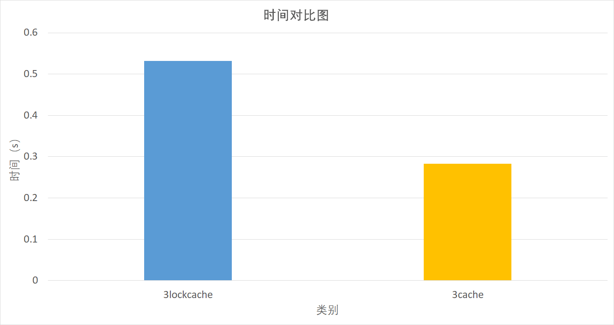

[TOC]

## 多核多线程实验

### Kbest

### 八种方案

#### 1.单线程

#### 2.两线程

> 计算 apple 的值和计算 orange 的值，属于完全不相关的两个操作，因此可以并行。 
> 将其改造为两线程程序

#### 3.三线程加锁

> 计算 apple 的值可以分解为两个线程， 一个用于计算 apple a 的值，另外一个线程用于计算 apple b 的值。但两个线程存在同时访问 apple 的可能性，所以需要加锁访问该数据结构。 

#### 4.三线程未加锁

>针对加锁的三线程方案，由于两个线程访问的是 apple 的不同元素，根本没有加锁的必 要，所以修改 apple 的数据结构（删除读写锁代码），通过不加锁来提高性能。 

#### 5.三线程加锁cache128

> 为了避免乒乓效应，让 apple 的两个成员 a 和 b 位于不同 的 cache 行中

<small>*ps:通过命令<code>getconf -a | grep CACHE</code>得到实验所用的电脑cacheline大小其实是64，但设置为128只是一行变为两行的差别，并不对实验有影响*</small>

#### 6.三线程未加锁cache128

> 解除读写锁，让 apple 的两个成员 a 和 b 位于不同 的 cache 行中

#### 7.两线程硬亲和力

> 在双核机器上，针对两线程的方案，如果将计算 apple 的线程绑定到一个 CPU 上，将 计算 orange 的线程绑定到另外一个 CPU 上

#### 8.三线程硬亲和力

>

### 八种方案比较&分析

##### 观察1~3，发现多线程比单线程更耗时

* 两线程慢于单线程

  线程启停以及线程上下文切换都会 引起额外的开销，所以消耗的时间比单线程多。

* 加锁后的三线程慢于两线程

  读写锁导致apple的两个线程不能同时访问数据，而使得这两个线程实际上只能串行执行，自然慢于两线程

  

##### 加锁与不加锁

* 发现4未加锁的三线程反而慢于3加锁的三线程

  

  这是由于，处理器交换的最小单元是 cache 行，或称 cache 块。在多核体系中，对于不共享 cache 的架构来说，两个独立的 cache 在需要读取同一 cache 行时，会共享该 cache 行，如 果在其中一个 cache 中，该 cache 行被写入，而在另一个 cache 中该 cache 行被读取， 那么即使读写的地址不相交，也需要在这两个 cache 之间移动数据，这就被称为 cache 伪共享 ，导致执行核必须在存储总线上来回传递这个 cache 行，这种现象被称为“乒乓 效应”。 
  同样地，当两个线程写入同一个 cache 的不同部分时，也会互相竞争该 cache 行，也 就是写后写的问题。因此，不加锁的方案反而比加锁的方案更慢，就是互相竞争 cache 的原因。

* 在都优化了cache后，如我们所设想的，6未加锁的三线程较之5加锁的三线程，运行速度明显提升

  

  

##### cache

* 发现5优化cache带锁的三线程较之3未优化cache带锁的三线程并无明显提升

  

  这是由于在该情况下，读写锁是导致其效率低的原因，需要解除读写锁才能对比出cache的作用

* 对比方案4、6，在都不带锁的情况下，优化cache带来了明显的提升

  

##### CPU亲和力

##### 8种方案的时间对比

